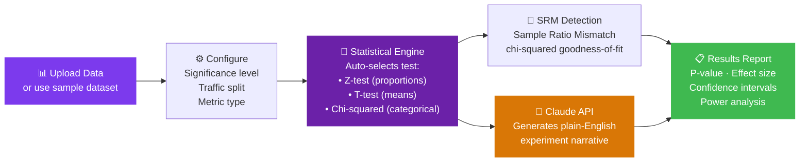

<div align="center">


<br/>

[](https://yashpal-adlab.streamlit.app)

<br/>

[](https://yashpal-adlab.streamlit.app)

<br/>

[](https://streamlit.io)
[](https://python.org)
[](https://anthropic.com)
[](https://scipy.org)
[](https://www.postgresql.org)

<br/>


</div>

---

## 🎯 The Problem

Running a statistically rigorous A/B test requires selecting the right statistical test, setting appropriate significance thresholds, detecting sample ratio mismatches, and then explaining what the results actually mean — all before you can act on the findings.

Most teams either skip the rigor and make bad decisions, or wait for an analyst to process the request.

This platform removes that bottleneck entirely. Upload your data, configure the experiment, and the platform runs the analysis and writes the explanation automatically.

---

## ✨ What It Does



---

## 🧪 Six Pages, One Platform

| Page | What It Does |
|------|-------------|
| 🎨 **Ad Creative Studio** | Upload or select test creatives, tag with genre/mood/CTA, real-time engagement score prediction |
| 🔬 **Experiment Simulator** | Generate synthetic data, configure sample sizes and effect sizes, watch experiments run |
| 📊 **Deep Analyzer** | Upload your own CSV, run full statistical analysis, get SRM detection automatically |
| 📢 **Executive Storyteller** | Claude API writes plain-English narrative from your results — ready to paste into a deck |
| 🧪 **SQL Lab & Gallery** | Query experiment data directly with SQL, browse historical experiments |
| 🚀 **Learn & Impress** | Interactive explainer of statistical concepts for non-technical teams |

---

## 🤖 The Claude API Integration

The most distinctive feature is automatic narrative generation. After the statistical engine computes results, the platform sends structured experiment data to Claude API and receives a plain-English summary that non-technical stakeholders can actually read.

```python
# Example output from Claude API narration:

"""
Variant B showed a statistically significant lift of 3.2 percentage points
in click-through rate (p=0.023, 95% CI: [0.4%, 6.0%]). With 94% statistical
power and no sample ratio mismatch detected, these results are reliable.

Recommendation: Roll out Variant B to 100% of traffic. At current volume,
this improvement corresponds to approximately 1,400 additional clicks per week.
"""
```

---

## 📐 Statistical Engine

The platform auto-selects the appropriate test based on your metric type:

| Metric Type | Test Used | When |
|-------------|-----------|------|
| Conversion rate / proportion | **Z-test** | Comparing two proportions |
| Revenue / continuous metric | **T-test (Welch's)** | Comparing two means |
| Categorical distribution | **Chi-squared** | Multi-cell frequency comparison |

**Sample Ratio Mismatch (SRM) Detection** runs automatically before results are displayed. An SRM occurs when the actual traffic split differs from the intended split — which invalidates the experiment entirely. The platform catches this before you act on bad data.

---

## 🔬 Statistical Rigor Built In

```python
# What runs under the hood on every experiment:

from scipy import stats

# 1. Auto-select test
test = select_test(metric_type, sample_sizes)

# 2. Run analysis
result = test.run(control, treatment, alpha=0.05)

# 3. Compute effect size (Cohen's d / relative lift)
effect = compute_effect_size(control, treatment)

# 4. Post-hoc power analysis
power = compute_power(effect, sample_sizes, alpha)

# 5. SRM check
srm_result = chi2_goodness_of_fit(actual_split, intended_split)

# 6. Send to Claude API for narrative
narrative = generate_narrative(result, effect, power, srm_result)
```

---

## 🚀 Run It Yourself

**Option 1 — Live Demo (no setup)**
👉 [yashpal-adlab.streamlit.app](https://yashpal-adlab.streamlit.app)

**Option 2 — Local**
```bash
git clone https://github.com/yashxsainix/enchanted-adlab
pip install -r requirements.txt

# Add your Claude API key
export ANTHROPIC_API_KEY="your-key-here"

streamlit run app.py
```

---

## 💡 Why This Exists

Most analyst time spent on A/B tests goes to setup, test selection, and writing the results summary — not to the actual statistical computation. This platform automates the mechanical parts so analysts can focus on experiment design and business interpretation.

The Claude API integration is not a gimmick. It is the difference between a result that sits in a spreadsheet and one that gets presented to leadership.

---

## 👤 Author

**Yashpal Saini** · [LinkedIn](https://linkedin.com/in/yash-saini-analyst) · [Portfolio](https://yashxsainix.github.io)


